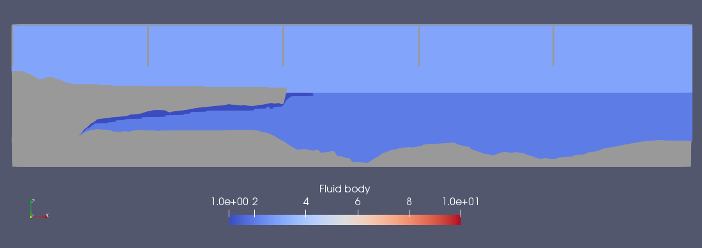
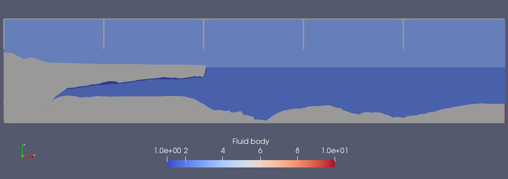
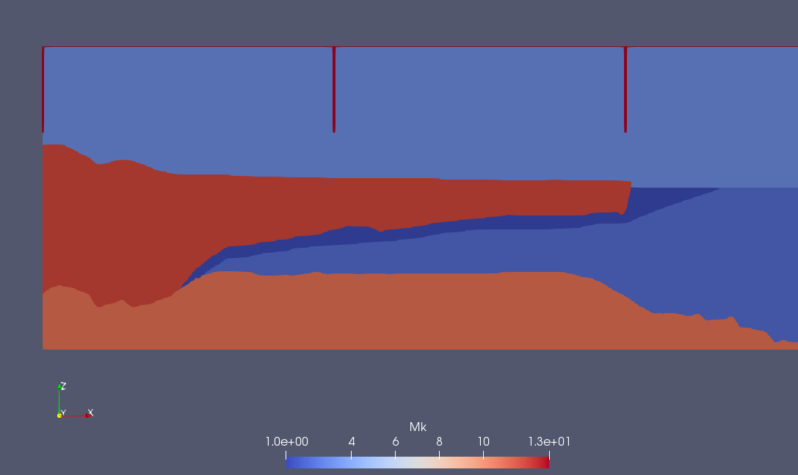
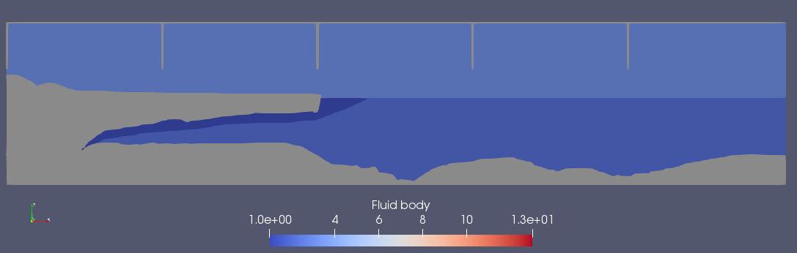

# CaseThwaitesSPH


## What

This repository contains the inputs, parameters, and outputs of a three-phase [DualSPHysics](https://github.com/DualSPHysics/DualSPHysics) model looking at the dynamics and interaction of forces beneath and outboard of the floating portion of Thwaites Glacier, West Antarctica. It was produced by Ian Nesbitt with assistance from the participants of the 2019 Earth and Climate Science Fluid Dynamics class at the University of Maine.

## Why

The goal of this project is to understand the forces and dynamic physics that act on Thwaites and contribute to the behavior of the floating and grounded portions of the ice sheet. Thwaites sits at the margin of one of the largest and most vulnerable major ice sheets in the world, the West Antarctic Ice Sheet (WAIS), much of which drains via Thwaites. Thwaites itself is understood to be a major keyhole to the WAIS; i.e. a collapse of Thwaites glacier could lead to a subsequent collapse of the entire WAIS, an ice body that contains approximately 3.3 meters' worth of global sea level.

## How

DualSPHysics is free and open-source code to model free-surface flow phenomena and calculate forces acting on a per-particle basis, where Eulerian and continuum models struggle. Models are constructed of particles, rather than meshes, which allows for computation of fluid interaction without the need to recompute mesh extent at each time step. Each particle has a bell curve-like "smoothing kernel" which defines the strength of its interaction with neighboring particles. Because so many interactions can happen over the course of a model run, DualSPHysics uses [CUDA](https://developer.nvidia.com/cuda-zone) to interface with graphics processing unit (GPU) computing power. Since GPUs contain many smaller cores whereas central processing units (CPUs) contain a few more powerful ones, GPUs can calculate interactions between many particles much more efficiently. For this reason, if you intend to run this code, we highly recommend running it with a CUDA-capable GPU. *Be warned: outputs from this model are huge, as it calculates particle information at thousands of time steps in each model run.*


### Code projects used to run the model and create outputs

All code used to create this project is proudly free and open-source. All observational data used to create seafloor and ice sheet geometry is released through the British Antarctic Survey's BEDMAP2 dataset and is freely available through Quantarctica 3.1.

- Ice sheet geometry: [BEDMAP2](https://www.bas.ac.uk/project/bedmap-2/) data from [Quantarctica](http://quantarctica.npolar.no/) 3.1 (queried using [QGIS](https://github.com/qgis/QGIS) 3.6)
- Conversion of XYZ to STL surfaces: [xyz2stl](https://github.com/NWRichmond/xyz2stl) v. Sept 2017 by [Nick Richmond](https://github.com/NWRichmond)
- Physics solver: [DualSPHysics](https://github.com/DualSPHysics/DualSPHysics) 4.2
- Visualization: [Paraview](https://github.com/Kitware/ParaView) 5.4.1
- Animations: [ffmpeg](https://github.com/FFmpeg/FFmpeg) 4.1.2


# Model runs

More details of model initialization parameters for each model run can be found in the `xx_CaseThwaites_Def.xml` files that reside in the root directory.

## Run 00 - 2019-04-01
### Geometry



We created bed and ice sheet geometry by loading four STL files representing bed, ice bottom, ice surface, and meltwater layers, and filling the space between them with either boundary (fixed) or fluid particles of densities listed below. This run was a test, and as such the STL files used to initialize are primitive.

### Initialization

#### Viscosity

We used equal artificial viscosities for all fluids in the model (CDW, meltwater, and atmosphere) because the DualSPHysics template used to create the parameters of this model, `CaseSloshingAcc_LiquidGas` (available with version 4.2 and described on page 96 of [this document](http://dual.sphysics.org/index.php/download_file/view/252/)), used equal values for its gas-water viscosity.

#### Density

We used idealized values of fluid density for atmospheric, meltwater, and CDW particles, as we wanted to test that the density gradient would yield sufficient buoyancy to represent the physical processes at work beneath the ice sheet. We assumed that meltwater was completely fresh and 0.1 degree C, and assigned CDW a value that approximated the densest ocean water observations.

- **Air**: 1.18 kg m<sup>-3</sup>
- **Meltwater**: 1000 kg m<sup>-3</sup>
- **CDW**: 1030 kg m<sup>-3</sup>

#### Atmospheric forcing

This model generates five wind paddles, which each travel at 3 model-meters per model-second over the surface. This is meant to simulate the transition between laminar flow in the upper atmosphere and boundary layer mixing near the surface.

#### Runtime

This run was 5 model-seconds long and consists of 1000 samples (sample rate 0.005 model-seconds). It took ~12 hours to compute on a NVIDIA GeForce GTX 1060.

## Run 01 - 2019-04-02
### Geometry



We refined STL files and decreased meltwater volume by thinning the meltwater parcel between ice and ocean water. Meltwater in model 00 was too buoyant. Too correct this we also decreased the density gradient in order to reduce some effects that cannot be found in nature, for example meltwater lenses boiling up past the elevation of the toe of the floating ice sheet.


### Initialization

#### Viscosity

We increased viscosity of water in order to slow particle migration across the water surface and attempt to more closely adhere to the atmosphere/water viscosity gradient observed in nature.

#### Density

We decreased CDW density from 1030 kg m<sup>-3</sup> to 1028 kg m<sup>-3</sup> to more accurately reflect the density of CDW at measured salinity and temperature values reported in Cook et al. ([2016](https://doi.org/10.1126/science.aae0017)). We increased meltwater density from 1000 kg m<sup>-3</sup> to 1015 kg m<sup>-3</sup> in order to keep a strong density gradient but move towards real "high meltwater fraction" temperature and salinity values measured around Thwaites.

- **Air**: 1.18 kg m<sup>-3</sup>
- **Meltwater**: 1015 kg m<sup>-3</sup>
- **CDW**: 1028 kg m<sup>-3</sup>

#### Atmospheric forcing

We re-initialized with the same wind paddle geometry and velocity.

#### Runtime

This run was 20 model-seconds long and consists of 4000 samples (sample rate 0.005 model-seconds). It took ~22 hours to compute on a NVIDIA GeForce GTX 1060.

## Run 02 - 2019-04-04
### Geometry



After run 01 we determined that the volume of meltwater was unsatisfactory. We calculated the expected meltwater flux for the floating portion of Thwaites using the method described by M. Dryak in her Master's thesis which follows from Enderlin and Hamilton ([2014](https://doi.org/10.3189/2014JoG14J085)). We then calculated the expected volume of meltwater given this flux and given the subglacial melt discharge modeled by De Brocq et al. ([2013](https://doi.org/10.1038/ngeo1977), available in [Quantarctica](http://quantarctica.npolar.no/)).

### Initialization

#### Viscosity

Viscosity is the same as run 01.

#### Density

Meltwater density observed in the eastern Amundsen Sea only differs from CDW in density by approximately 0.33 kg/m<sup>3</sup> (P. Dutrieux, pers. comm.; [Jenkins et al., 2018](https://doi.org/10.1038/s41561-018-0207-4)). For the purposes of this experiment, we initialized with a slightly higher density gradient in order to speed up the physical processes in model-time.

We also increased the density value of atmospheric particles to more accurately reflect that of air masses which contribute to catabatic wind flow from the ice sheet to the Southern Ocean.

- **Air**: 1.44 kg m<sup>-3</sup>
- **Meltwater**: 1026 kg m<sup>-3</sup>
- **CDW**: 1028 kg m<sup>-3</sup>

#### Atmospheric forcing

We re-initialized with the same wind paddle geometry and velocity.

#### Runtime

This run was 30 model-seconds long and consists of 3000 samples (sample rate 0.01 model-seconds). It took ~28 hours to compute on a NVIDIA GeForce GTX 1060.

## Run 03 - 2019-04-06
### Geometry



After run 02 we determined that the density gradient between meltwater and CDW was not high enough. 

### Initialization

#### Viscosity

Viscosity is the same as run 01.

#### Density

We changed meltwater density to 1020 kg m<sup>3</sup>, making the gradient approximately an order of magnitude greater than in-situ measurements show, in order to more strongly separate meltwater from deep water. This stronger density gradient balances out the greater effective wind shear at the interface between ocean and atmosphere in modeled vs. real conditions.

- **Air**: 1.44 kg m<sup>-3</sup>
- **Meltwater**: 1020 kg m<sup>-3</sup>
- **CDW**: 1028 kg m<sup>-3</sup>

#### Atmospheric forcing

We re-initialized with the same wind paddle geometry and velocity.

#### Runtime

This run was 30 model-seconds long and consists of 3000 samples (sample rate 0.01 model-seconds). It took ~28 hours to compute on a NVIDIA GeForce GTX 1060.

## Description of project contents

### File organization

Files that specifically pertain to one model run are prefaced with the number of that model run. For example, the files used for or output by run 0 will be named `00_FILENAME`, those related specifically to run 1 will be named `01_FILENAME`, etc. Thus the inputs and outputs can remain in the state they were at runtime for future reference.

### File structure

The following is a directory tree describing the contents of the repository and their function.

```
.
├── animations                                  # folder for paraview output and ffmpeg rendering
│   ├── 00_vel_type_id.0900.png                 # image showing a model time step from run 00.
│   └── *_geometry.png                          # image of geometry from each model run
├── bin                                         # non-SPH scripts
│   └── timelapse*                              # unix/linux bash scripts which use ffmpeg to create XXfps timelapses from a folder full of successively-named .png files, such as produced by ParaView's "save animation" feature
├── gis                                         # GIS and geometry
│   ├── geom_thwaites.*                         # shapefile of transect used to query BEDMAP2 elevations
│   ├── geom_thwaites_pts.*                     # points along transect used for query (1 km spacing)
│   ├── geom_thwaites_vals.csv                  # CSV of values queried along transect for 1) ice surface elevation, 2) ice bottom elevation, and 3) bathymetry and bed
│   ├── model_thwaites_pandasDF.csv             # intermediate step with ice surface, ice bottom, bathymetry, and X distance
│   ├── model_thwaites_lyrs_pandasDF.csv        # intermediate step adding meltwater column and other potential features
│   └── xyz                                     # XYZ surfaces output from pandas and modified as spreadsheets
│       ├── *_z_*.xyz                           # previous versions of XYZ geometry
│       ├── z_ice_bed.xyz                       # most recent version of bed geometry
│       ├── z_ice_bott.xyz                      # most recent version of ice bottom geometry
│       ├── z_ice_sfc.xyz                       # most recent version of ice surface geometry
│       └── z_mw.xyz                            # most recent version of meltwater (bottom) geometry
├── 00_z_ice_bed.stl                            # bed and seafloor geometry STL from BEDMAP2 used for run 00, can be read with <drawfilestl file="00_z_ice_bed.stl">
├── 00_z_ice_bott.stl                           # ice bottom geometry STL from BEDMAP2, can be read from xml by GenCase with <drawfilestl file="00_z_ice_bott.stl">
├── 00_z_ice_sfc.stl                            # ice surface geometry STL from BEDMAP2, can be read from xml by GenCase with <drawfilestl file="00_z_ice_sfc.stl">
├── 00_z_mw.stl                                 # meltwater geometry STL, can be read from xml by GenCase with <drawfilestl file="00_z_mw.stl">
├── casedata.dsphdata                           # SPH synthesis of case data described by case description XML
├── 00_CaseThwaites01_Def.xml                   # run 00 case description XML
├── 01_CaseThwaites01_Def.xml                   # run 01 case description XML
├── CaseThwaites01_Def.xml                      # current case description XML (not yet run)
├── DSPH_Case.FCStd                             # DesignSPHysics file used to create the initial geometry
├── DSPH_Case.FCStd1                            # DesignSPHysics file used to create the initial geometry
├── GenCase4_linux64.bi4                        # GenCase output binary file
├── GenCase4_linux64__Dp.vtk                    # GenCase output of boundary particle limits (use Paraview to display)
├── GenCase4_linux64_MkCells.vtk                # GenCase output of particle generation cells
├── GenCase4_linux64.out                        # command line output of GenCase
├── GenCase4_linux64.xml                        # GenCase synthesis xml
├── GenCase4_linux64_z_ice_bed_Dp.vtk           # quantized (downsized) bed geometry from BEDMAP2, can be read from xml by GenCase with <drawfilevtk file="GenCase4_linux64_z_ice_bed_Dp.vtk">
├── GenCase4_linux64_z_ice_bott_Dp.vtk          # quantized (downsized) ice bottom geometry from BEDMAP2, can be read from xml by GenCase with <drawfilevtk file="GenCase4_linux64_z_ice_bott_Dp.vtk">
├── GenCase4_linux64_z_ice_sfc_Dp.vtk           # quantized (downsized) ice surface geometry from BEDMAP2, can be read from xml by GenCase with <drawfilevtk file="GenCase4_linux64_z_ice_sfc_Dp.vtk">
├── GenCase4_linux64_z_mw_Dp.vtk                # quantized (downsized) meltwater bottom geometry, can be read from xml by GenCase with <drawfilevtk file="GenCase4_linux64_z_mw_Dp.vtk">
├── xCaseThwaites_threephase_linux64_GPU.sh     # bash script used to run all model processing steps (linux/unix version)
└── README.md                                   # this file
```

## References

Cook, A. J., Holland, P. R., Meredith, M. P., Murray, T., Luckman, A., & Vaughan, D. G. (2016). *Ocean forcing of glacier retreat in the western antarctic peninsula*. Science, v. 353 no. 6296, 283-286. [doi:10.1126/science.aae0017](https://doi.org/10.1126/science.aae0017).

Enderlin, E. M., & Hamilton, G. S. (2014). *Estimates of iceberg submarine melting from high-resolution digital elevation models: application to Sermilik Fjord, East Greenland*. Journal of Glaciology v. 60 no. 224, pp. 1084-1092, [doi:10.3189/2014JoG14J085](https://doi.org/10.3189/2014JoG14J085).

Jenkins, A., Shoosmith, D., Dutrieux, P., & Jacobs, S. (2018). *West antarctic ice sheet retreat in the amundsen sea driven by decadal oceanic variability*. Nature Geoscience. v. 11 no. 10. [doi:10.1038/s41561-018-0207-4](https://doi.org/10.1038/s41561-018-0207-4)

Le Brocq, A. M., Le Brocq, A. M., Ross, N., Griggs, J. A., & Bingham, R. G. (2013). *Evidence from ice shelves for channelized meltwater flow beneath the antarctic ice sheet*. Nature Geoscience. v. 6 no. 11, pp. 945–948, [doi:10.1038/ngeo1977](https://doi.org/10.1038/ngeo1977).
